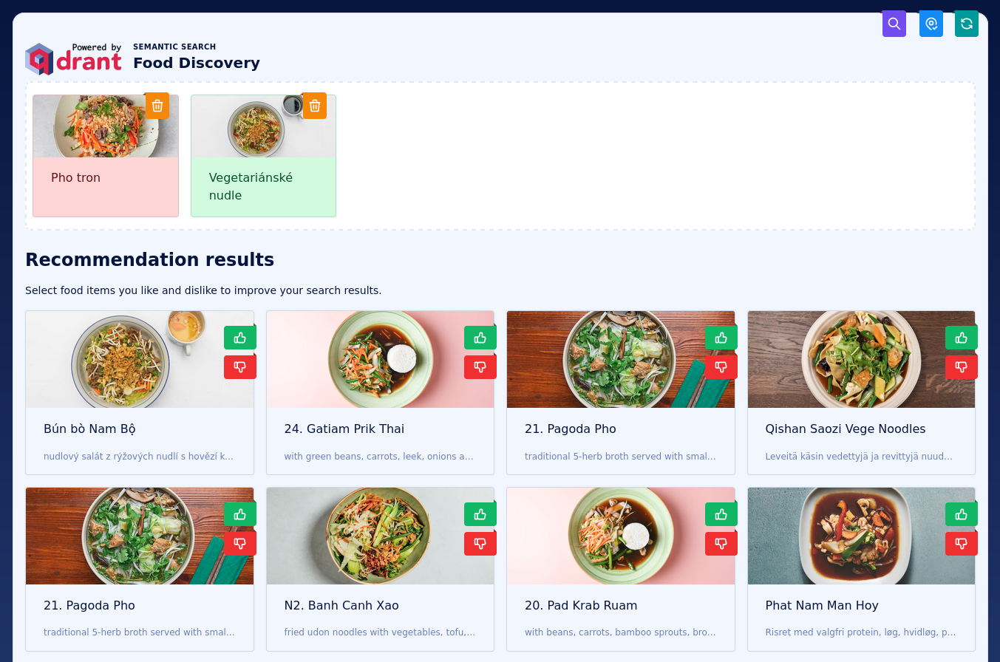

# Food Discovery with Qdrant

## Description

This is a demo project for the [Qdrant](https://qdrant.tech) vector search engine. It 
allows searching for dishes based on their photos. The search is, however, not based on
queries, but on a discovery. The user is presented with a set of images and asked to 
select the ones that they like or not. That's a different paradigm of search, which 
might be more natural for humans in some specific cases, like food. **If you are hungry, 
you might not know precisely what you want, but want to see some options and explore 
them.**

The demo is based on the [Wolt](https://wolt.com/) dataset of dishes. It contains 
around 100k images of dishes from different restaurants. The images are vectorized with
the [CLIP](https://openai.com/blog/clip/) model and indexed in Qdrant. For the 
simplicity, we use the `clip-ViT-B-32` model available in the 
[Sentence-Transformers](https://www.sbert.net/examples/applications/image-search/README.html)
library.

The demo uses the [FastAPI](https://fastapi.tiangolo.com/) framework for the backend and 
[React](https://reactjs.org/) for the frontend. Qdrant [Recommendation API](
https://qdrant.tech/documentation/concepts/search/#recommendation-api) 
is used internally to find some other items that are visually similar to the liked ones 
and dissimilar to the disliked ones. All the components are enclosed in Docker Compose
and can be run with a single command.

Proposed mechanism is embedding-agnostic, so it can be used with any image embeddings.
We do not vectorize queries during the search, but rather use the same embeddings that
were used during the indexing. Thus, there is no vectorization overhead during the 
search, what makes it very fast.

<video src="images/food-discovery-demo.mp4" width="990" />

## Architecture


The demo consists of the following components:
- [React frontend](/frontend) - a web application that allows the user to interact with the demo
- [FastAPI backend](/backend) - a backend that communicates with Qdrant and exposes a REST API
- [Qdrant](https://qdrant.tech/) - a vector search engine that stores the data and performs the search
- [Caddy webserver](https://caddyserver.com/) - a reverse proxy that allows to serve the frontend and the backend

All the components come pre-configured and can be run with a single command. 

## Usage

If you want to set up the demo locally, you need to have [Docker](https://www.docker.com/)
and [Docker Compose](https://docs.docker.com/compose/) installed. Then, you can follow 
the instructions below.

### Running the demo

In order to set up the demo, you need to have a running Qdrant server. You can either
run it locally or use a [Qdrant Cloud](https://cloud.qdrant.io/) instance. There is a
small difference in how you need to configure the demo in these two cases.

#### Qdrant Cloud instance

If you prefer to use a Qdrant Cloud instance, please create a cluster and API key in
the [Qdrant Cloud Console](https://cloud.qdrant.io). Then, create a `.env` file using
the template provided in the `.env.example` file and set the following variables:

```dotenv
QDRANT_URL=<< QDRANT_URL >>
QDRANT_API_KEY=<< QDRANT_API_KEY >>
QDRANT_COLLECTION=wolt-clip-ViT-B-32
```

You can adjust the collection name, but make sure that to use the same name for all
the other steps. Once configured, you can launch the project with Docker Compose:

```bash
docker-compose up -d
```

#### Local Qdrant instance

If you decided to run Qdrant locally, you can start with configuring the `.env` file, 
based on the provided `.env.example` template. Here is how it should look like:

```dotenv
QDRANT_URL=http://qdrant:6333
QDRANT_COLLECTION=wolt-clip-ViT-B-32
```

Then, you can launch the project with Docker Compose:

```bash
docker-compose --profile local up -d
```

### Importing a snapshot

At this point, you should have a running demo. However, it does not contain any data,
but the web application is already available at http://localhost:8080. You can open it
in your browser.


TODO: a structure of the Qdrant points in the collection

TODO: describe how to import a snapshot on local instance

```bash
docker-compose up -d
```

### Final steps

Once your demo is up and running, you can open it in your browser at 
http://localhost:8080 and finally start using it.



By clicking the buttons, you can navigate through the search results.

## Links

Some of the links that were useful during the development:

- https://www.erraticbits.ca/post/2021/fastapi/
